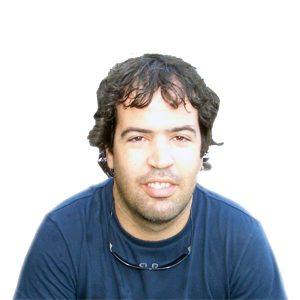

### Maykel Suarez  
1200 Brickell Bay Dr PH4202, Miami, FL 33131  
(786) 797-3547 mikemps@gmail.com

-

### Experience
`Jun 2008 - present` [Ultimate Software:](http://www.ultimatesoftware.com) Contributed to many teams and projects spanning from devops and end-user facing to core and architectural.

*	Designed a Hypermedia service that connected the object model with a rules engine.
*	Debugged and refactored an effective dating implementation on Mongo.
*	Automated the deployment on AWS and OpenStack with Chef and Ruby.
*	Created a REST service with Rails to orchestrate TeamCity, Rightscale and Rake.
*	Contributed to a framework that exposes the domain model via WCF.
*	Hosted half a dozen lunch and learn sessions.
*	Improved end-to-end tests quality with Cucumber and Fitnesse.
*	Created, wrapped or improved mock frameworks in C#, Ruby and Delphi.

`2004 - 2008`	[Alienware:](http://www.alienware.com) Started supporting internal tools. Became a key player adapting Agile ideas while delivering successful apps to customers.
*	Optimized the factory process reducing the integration time per PC by 25 percent.
*	Helped founding a new breadth of WPF apps that gained praise in magazine reviews and was expanded into the Dell branding.
*	Reengineered a legacy C++ account manager system into C# in four months. Lead the team to deliver simultaneously WinForm and ASP.NET clients.
*	Defined the team’s methodology mixing XP, Scrum and Crystal Clear.
*	Employed acceptance tests to enhance the communication with an offshore team.
*	Created a custom workflow engine for Sharepoint.

###Contracts
`2007-2008`	[e-Spare:](http://www.e-spare.ca) Developed a Java web app with a distributed team (Miami/Toronto).  
`2002-2003`	[University of Miami:](http://www.miami.edu) Developed a budget tracking app in VB for the Admission Office.  
`2001-2002`	[Grocerytaxi:](http://www.grocerytaxi.com) Migrated the website from HTML to classic ASP.  
`1998-2000`	[Panautos:](http://www.cuba.cu/turismo/panatrans/panautos.htm) Created the app used to rent the cars Delphi/MSSQL.  

###Open Source
`2013` [Frankendoc:](https://github.com/limadelic/frankendoc) Brings documents alive.  
`2012` [Datomicjs:](https://github.com/limadelic/datomicjs) Javascript driver for Datomic.  
`2011` [Decaf:](https://github.com/limadelic/decaf) Official Fitnesse/Slim port to CoffeeScript.  
`2010` [Raconteur:](http://raconteur.github.com/) Acceptance test framework for C#.  
`2008` [FluentSpec:](http://fluentspec.codeplex.com/) C# mock framework with BDD flavor.  

###Education
`2001-2003`	University of Miami, FL – BS Computer Science.  
`1994-2000`	University of Havana, Cuba – BS Computer Science.

